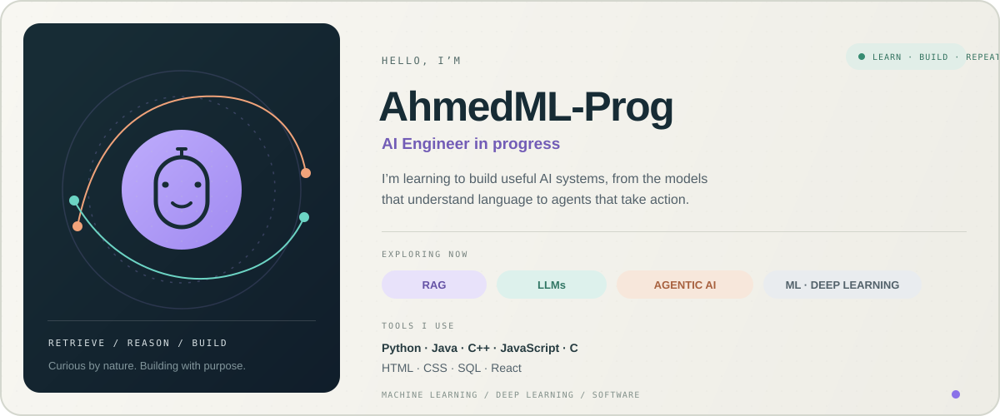

 

## About

I’m an AI Engineer in progress, learning to build practical intelligent systems. My current focus is **Retrieval-Augmented Generation (RAG)**, **Large Language Models (LLMs)**, and **agentic AI**, alongside machine learning and deep learning.

## Skills

**Languages:** Python · Java · C++ · JavaScript · C · HTML · CSS  
**Technologies:** SQL · React  
**Areas:** Machine Learning · Deep Learning · RAG · LLMs · Agentic AI

*Curious by nature. Building with purpose.*

